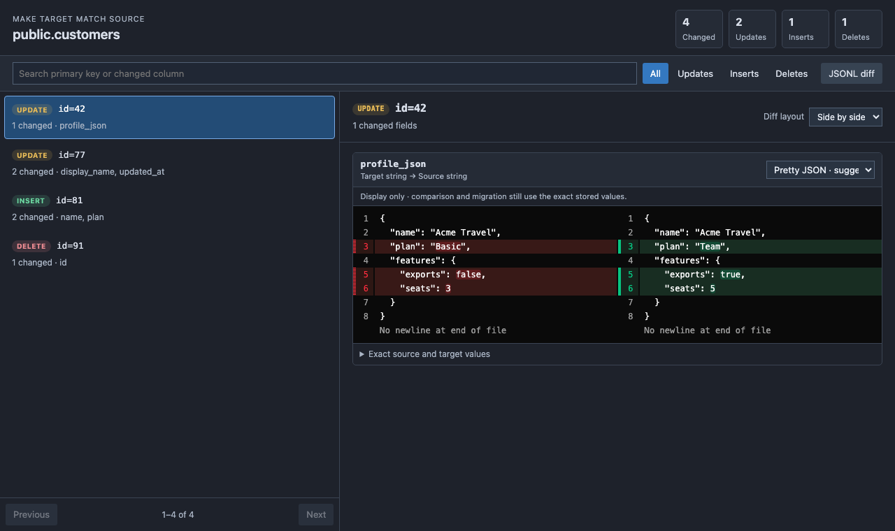
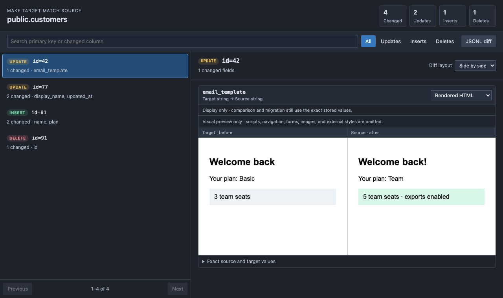

<p align="center">
  
</p>

# ReconcileDB for VS Code

Compare selected row data between two databases with the same schema, inspect the generated SQL, and choose when to apply it. ReconcileDB is local-first: database connections and generated files stay on your machine.

> **Thank you, Nguyen Ngoc Long.** ReconcileDB for VS Code is an independently maintained fork of [Data Sync](https://github.com/nguyenngoclongdev/vs-data-sync), originally created by Nguyen Ngoc Long. His work made this extension possible. The upstream copyright and MIT license are preserved in [LICENSE](LICENSE). This project is not affiliated with or endorsed by the original maintainer.

[](https://marketplace.visualstudio.com/items?itemName=JacobCofman.reconciledb-vscode)
[](https://open-vsx.org/extension/JacobCofman/reconciledb-vscode)
[](LICENSE)

## New in 1.1.0: review changes row by row

The comparison view puts the decision-making details together before you run a migration:

1. Select a table under **Compare** to see insert, update, and delete counts. Filter by operation or search for a row by its key or changed column.
2. Select a row to see only its changed fields, with target (**before**) and source (**after**) values side by side. Switch to a unified diff when that is easier to read.
3. For a long text field, switch its view from **Raw text** to **Pretty JSON**, **Pretty HTML**, or **Rendered HTML**. JSON and HTML suggestions help you find a useful view, but the choice stays yours.
4. Expand **Exact source and target values** whenever you need to inspect the original data, then review the generated migration SQL before applying anything.

These screenshots show the actual comparison view with fictional sample data:

**Pretty JSON:** line-level changes in a structured text column, alongside the row list and change filters.



**Rendered HTML:** isolated before-and-after previews of an HTML text column.



Field diffs use [Pierre Diffs](https://github.com/pierrecomputer/pierre). The row list stays compact, and full field values are loaded only for the row you select. Formatting runs on demand, so large JSON or HTML columns do not need to be prettified just to browse the results.

The rendered HTML view is an isolated visual preview: it omits scripts, navigation, forms, images, and external styles. Views are **display-only**—comparison and migration always use the exact stored values. Values over 2 MB remain available in Raw text instead of being formatted or previewed.

## What it does

- Compares row data from PostgreSQL to PostgreSQL or SQL Server to SQL Server.
- Lets you select tables and columns, exclude volatile columns, filter rows, and define stable ordering or primary keys.
- Opens a row-first comparison review with operation filters, primary-key search, changed-column summaries, and field-level source/target values.
- Loads large field values only when their row is selected, renders them with [Pierre Diffs](https://github.com/pierrecomputer/pierre), and keeps the original JSONL diff available as a fallback.
- Offers per-field Pretty JSON, Pretty HTML, and isolated HTML previews while retaining the exact stored values for comparison and migration.
- Shows the generated migration plan before anything is applied.
- Generates inserts, updates, and deletes that can be individually disabled.
- Applies migrations in a transaction and reports suspicious row counts.
- Uses exact value comparison. ReconcileDB does not silently normalize text, timestamps, or numbers.

ReconcileDB `1.1.x` does not compare or migrate database schemas, perform cross-engine synchronization, or run as a VS Code web extension.

## Installation

Install **ReconcileDB for VS Code** from the [Visual Studio Marketplace](https://marketplace.visualstudio.com/items?itemName=JacobCofman.reconciledb-vscode) or [Open VSX Registry](https://open-vsx.org/extension/JacobCofman/reconciledb-vscode).

The universal desktop package supports PostgreSQL and SQL Server username/password authentication on Windows, macOS, and Linux.

## Quick start

1. Open the ReconcileDB activity-bar view.
2. Choose **Generate Configuration File**.
3. Configure a source and target of the same database engine.
4. Select the tables, keys, and columns to compare.
5. Run **Analyze Data**, select a table under **Compare** to review changed rows and fields, inspect the migration SQL, then explicitly choose whether to execute it.

The existing `data-sync.*` command IDs, settings, and `database.json` format remain compatible with the original extension so existing local configurations can be reused.

### PostgreSQL example

```jsonc
{
  "verbose": false,
  "patterns": {
    "staging-to-local": {
      "source": {
        "type": "postgres",
        "host": "staging.example.test",
        "port": 5432,
        "database": "app",
        "user": "reconciler"
      },
      "target": {
        "type": "postgres",
        "host": "localhost",
        "port": 5432,
        "database": "app",
        "user": "postgres"
      },
      "diff": {
        "tables": [
          {
            "schema": "public",
            "name": "customers",
            "primaryKeys": ["id"],
            "excludes": ["updated_at"],
            "orderBy": "id"
          }
        ]
      },
      "migrate": {
        "noInsert": false,
        "noUpdate": false,
        "noDelete": false,
        "noRowAffected": "warn",
        "multipleRowAffected": "throw"
      }
    }
  }
}
```

### SQL Server example

For SQL Server authentication, use the same structure with `"type": "mssql"`, normally on port `1433`:

```jsonc
{
  "type": "mssql",
  "host": "localhost",
  "port": 1433,
  "database": "app",
  "user": "reconciler"
}
```

When the password property is omitted, ReconcileDB prompts for it. Username/password connection strings are also supported.

## Might implement later

- Windows integrated authentication. This would require revisiting native-driver packaging; for now, use SQL Server username/password authentication.

## Safety notes

- Review generated migration SQL before execution, especially deletes.
- Use a least-privilege database account and test against disposable data first.
- Put secrets in a local configuration ignored by source control. If `password` is omitted, the extension can prompt for it.
- Define `primaryKeys` or a deterministic `orderBy` for tables without discoverable primary keys.
- Exclude columns such as generated timestamps, row versions, audit metadata, or environment-specific identifiers when they are intentionally different.

## Feedback

Please report bugs and feature requests in the [JCofman/vs-data-sync issue tracker](https://github.com/JCofman/vs-data-sync/issues).

## License

ReconcileDB for VS Code is distributed under the [MIT License](LICENSE).

Field-level diff rendering uses [`@pierre/diffs`](https://github.com/pierrecomputer/pierre), distributed under the Apache License 2.0. Its license is included in packaged extensions.
HTML presentation uses [Prettier](https://prettier.io/), distributed under the MIT License. Its license is also included in packaged extensions.
Rendered HTML previews use [DOMPurify](https://github.com/cure53/DOMPurify) under the Apache 2.0 License, which is included in packaged extensions.
